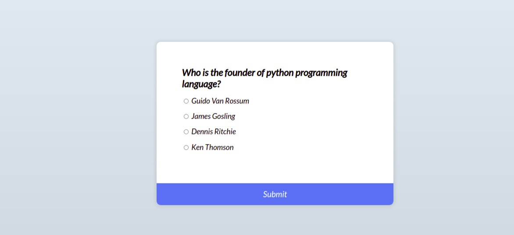
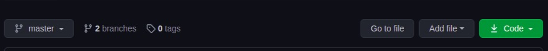
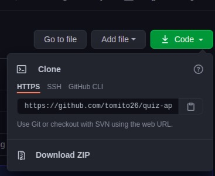

# Quiz App
This an application that contains questions and multiple choice answers and the user is expected to answer them and will later be graded based on the answers he/she has given


## Features
* The application has a card centered on the page with the questions and the multiple choice answers with the radio button
* The card also has a button on the lower part of the card which  when clicked will take the user to the next question only if the user answers the question.
* The card has 5 questions which when the user  is done answering all of them  will get  scores based on how they have answered the questions
* After the last question when the user clicks the submit button,the card will display the scores out of the total number of questions and a button which when clicked reloads the page and user can answer the questions afresh
  
  ## Project SetUp
The application is accessible on github which you can either clone the application or download it then unzip it.
To clone the project you need to copy the repository by clicking on this green button on github 


  Which  will display the repository link



You the copy the above repositiry link and paste it on your terminal as shown below
 ```
 $ git clone <repository link>
 ```
Then you go to the project folder  of the project you just cloned
 ```
$ cd <project-directory>
 ```
Then you use command for  opening the project on your IDE
 ```
$ code . / atom .
 ```
And  the project is on your local machine
For vscode click on live server or right click then choose open server among the options on the menu that appears, which will open the project on the  browser 

## Technologies
* HTML5
* CSS3
* JavaScript
  
 ## Contact
For any enquiries relating to the project feel free to contact ingasiathomas@gmail.com
## License and Copyright
Licensed under [MIT License](license)

